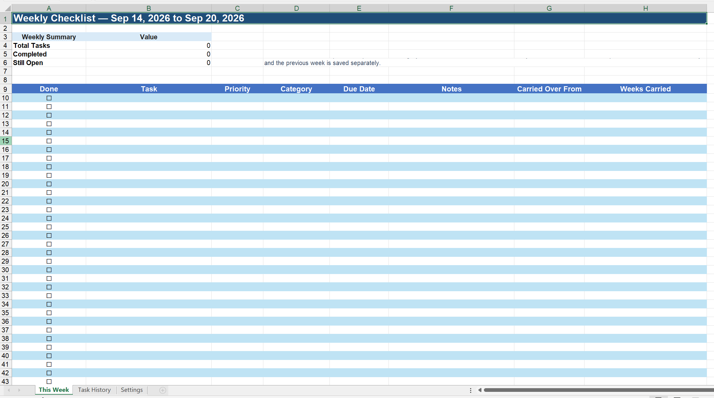
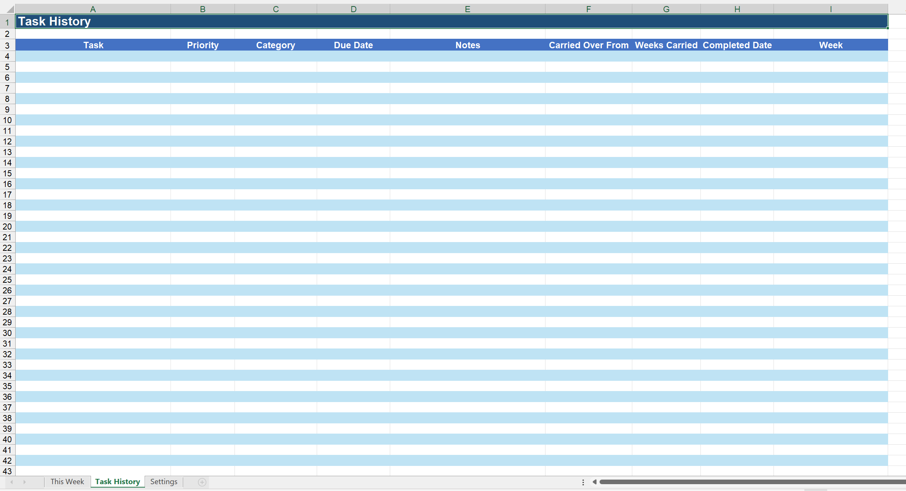
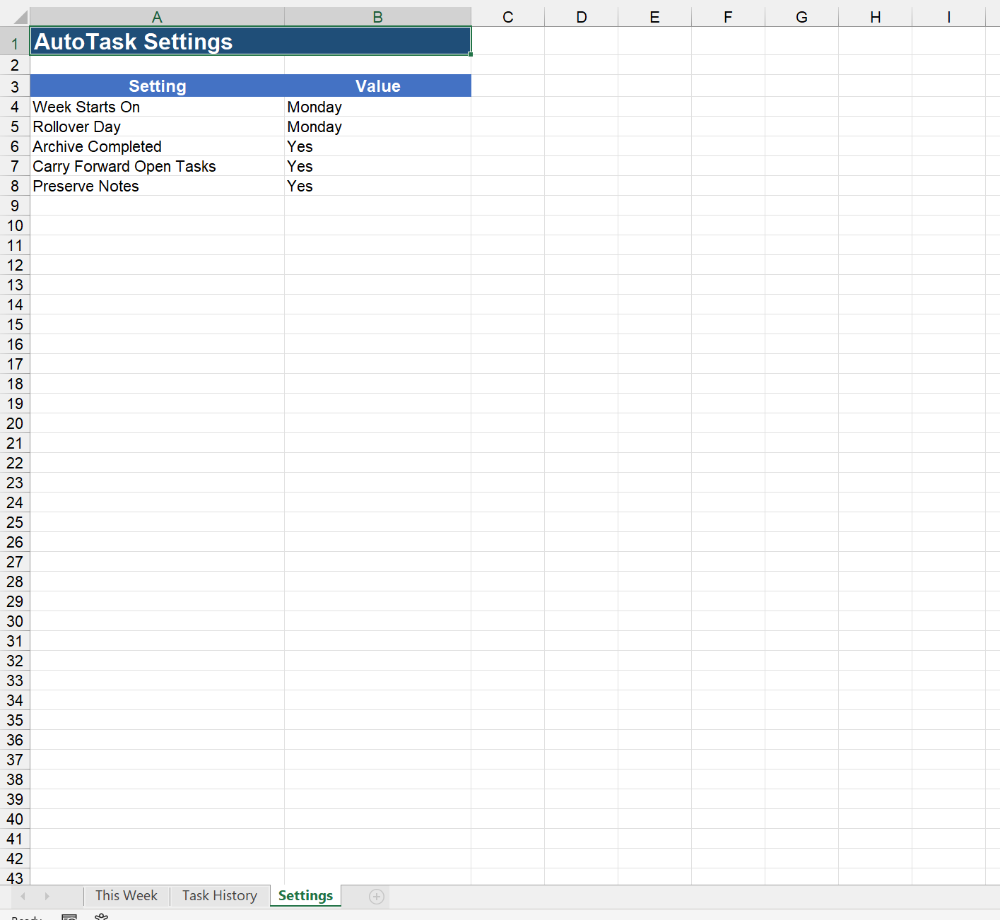
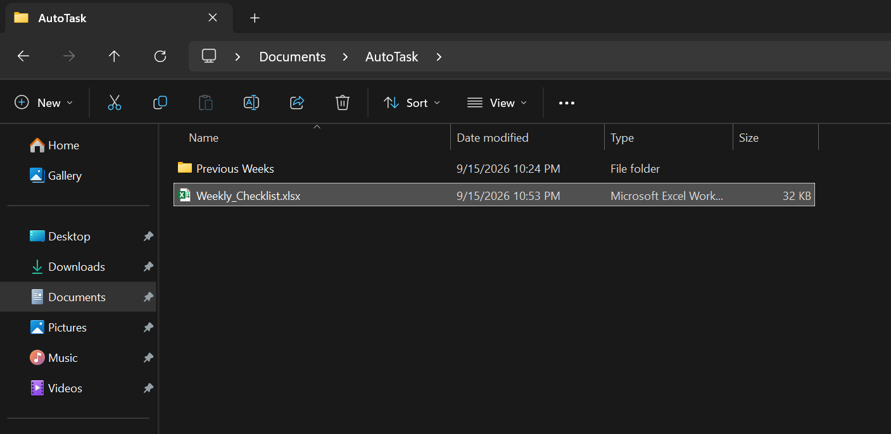

# AutoTask

AutoTask was built with TypeScript, PowerShell, Microsoft Excel, and Windows Task Scheduler and was built for a Windows 11 + WSL + Ubuntu enviornment using AI. It automates the maintenance of a weekly Excel task list while keeping the workbook local to the computer. 

I built it to serve as my basic weekly, to-do list.

## What AutoTask Does

The Excel workbook contains three sheets:

* **This Week** — the active weekly checklist:



* **Task History** — completed tasks:



* **Settings** — controls rollover behavior:



During a rollover, AutoTask:

1. Checks the computer's current date.
2. Calculates the current Monday–Sunday week.
3. Archives the previous week's workbook.
4. Moves completed tasks into `Task History`.
5. Carries unfinished tasks into the current week.
6. Preserves notes when enabled.
7. Tracks when a task was first carried over.
8. Calculates how many weeks a task has been carried.
9. Updates the workbook's week title.
10. Saves the workbook through Microsoft Excel.

# Set Up:
1. Create the location for AutoTask- I recommend:
    -  going to Documents
    -  creating a folder called AutoTask
    -  within the new AutoTask folder, creating a folder called Previous Weeks
2. Then take the Weekly_Checklist.xlsx file from templates and place it within the AutoTask folder. It should look something like this:



3. Clone this repo on your local machine
4. Install it's dependencies with `npm install`.
5. Create a .env set up the paths to your Weekly_Checklist.xlsx and Previous Weeks folders (refer to the .env example and the documentation below in Environment Variables)
5. Within the Weekly_Checklist.xlsx file- pick the day of the week you'd like the weekly rollover to occur on (the default is set to Monday, and will occur at 8am or any time after 8am if the window is missed).
5. Run the script `npm run configure`.

## This Week

The main checklist contains:

| Column | Field             |
| ------ | ----------------- |
| A      | Done              |
| B      | Task              |
| C      | Priority          |
| D      | Category          |
| E      | Due Date          |
| F      | Notes             |
| G      | Carried Over From |
| H      | Weeks Carried     |

Tasks use:

* `☐` — incomplete
* `☑` — complete

Priority and Category use Excel dropdowns.

And dates are displayed as: `MM/DD/YYYY`

## Task History

Completed tasks are moved into `Task History`.

Task History contains:

| Column | Field             |
| ------ | ----------------- |
| A      | Task              |
| B      | Priority          |
| C      | Category          |
| D      | Due Date          |
| E      | Notes             |
| F      | Carried Over From |
| G      | Weeks Carried     |
| H      | Completed Date    |
| I      | Week              |

The `Week` field represents the actual Monday–Sunday week in which the task was completed.

## Carrying Tasks Forward

Incomplete tasks are automatically carry into the next week.

`Carried Over From` stores the original date associated with the task being carried forward.

`Weeks Carried` is calculated from the actual calendar weeks between that date and the current week.

## Previous Weeks

When the workbook moves into a new week, AutoTask saves a copy of the previous workbook in the configured `Previous Weeks` folder.

Example:

`2026-09-14_to_2026-09-20.xlsx`

This preserves a complete weekly snapshot in addition to the individual completed tasks stored in `Task History`.

## Settings

The `Settings` worksheet controls the automation.

Current settings include:

* Week Starts On
* Rollover Day
* Archive Completed
* Carry Forward Open Tasks
* Preserve Notes

The rollover day is used when configuring Windows Task Scheduler.

If the rollover day changes, run: `npm run configure`

## Automatic Scheduling

AutoTask creates a Windows scheduled task named:

`AutoTask Weekly Rollover`

The task runs at **8:00 AM** on the configured rollover day.

It also uses Windows Task Scheduler's `StartWhenAvailable` setting.

If the computer is turned off when the rollover was supposed to run, Windows can run the missed task when the computer becomes available again.

Configure or update the scheduled task with: `npm run configure`

Run a rollover manually with: `npm run rollover`

## Project Structure

The WeeklyChecklist.xlsx should be placed on your local machine

Example:

```
C:\Users\<username>\Documents\AutoTask\
├── Weekly_Checklist.xlsx
└── Previous Weeks\
```

The location may instead be inside OneDrive if Windows Documents is redirected there.

## Environment Variables

Local paths are configured in `.env`.

Example:

```
CHECKLIST=/mnt/c/Users/username/OneDrive/Documents/AutoTask/Weekly_Checklist.xlsx
PREVIOUS_WEEKS=/mnt/c/Users/username/OneDrive/Documents/AutoTask/Previous Weeks
```

## Technology

AutoTask uses:

* TypeScript
* Node.js
* PowerShell
* Microsoft Excel
* Excel COM automation
* WSL
* Windows Task Scheduler
* dotenv

The Node and TypeScript project runs inside WSL.

When Windows functionality is required, AutoTask calls Windows PowerShell from WSL.

PowerShell controls the locally installed copy of Microsoft Excel through COM automation.

## Why Excel COM?

An earlier implementation used a JavaScript XLSX library to modify the workbook directly.

Although the workbook data could be changed, rewriting the file caused Excel-specific formatting and features to be lost.

The final implementation instead allows Microsoft Excel itself to open, modify, and save the workbook.

This preserves the workbook's existing:

* colors
* borders
* fonts
* dropdowns
* conditional formatting
* date formatting
* column widths
* row heights
* worksheet formatting

The basic process is:

```
Open workbook
→ modify existing cells
→ save workbook
```

## AI-Assisted Development

AutoTask was developed with the assistance of an AI coding agent. The AI agent was used as a pair-programming, research, and debugging tool throughout development. The project was developed iteratively rather than generated in a single prompt.

The workflow included:

```
Define requirements
→ implement
→ test on the real machine
→ inspect failures
→ research the relevant documentation
→ revise the implementation
→ retest
→ refine
```

The developer remained responsible for the project's requirements, architecture decisions, testing, and final behavior (and of course- evaluated and refined the AI output). The AI agent acted as a development assistant to help implement and troubleshoot those requirements.

## Requirements

AutoTask currently requires:

* Windows 11
* WSL
* Node.js
* npm
* PowerShell
* Microsoft Excel desktop
* Windows Task Scheduler

Because AutoTask uses Excel COM automation, Microsoft Excel must be installed locally.
